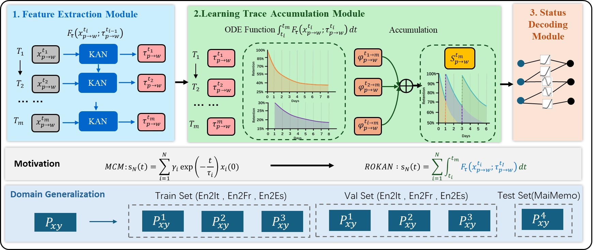
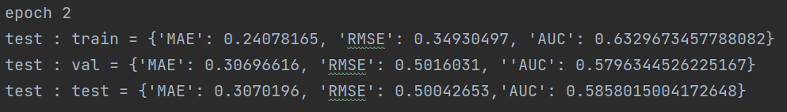

## ROKAN: A Domain-Generalizable and Explainable Framework for Memory Behavior Modeling




### **Environment Configuration**
```
- Python 3.9 or higher
- PyTorch >= 1.13.1
- NumPy >= 1.22.4
- GPU: NVIDIA GTX 1080 Ti or higher
- RAM: 8 GB or more
```

### Run main.py
```cmd
python main.py
```

In cross domain scenarios, the experimental results with MaiMemo as the test set are as follows
